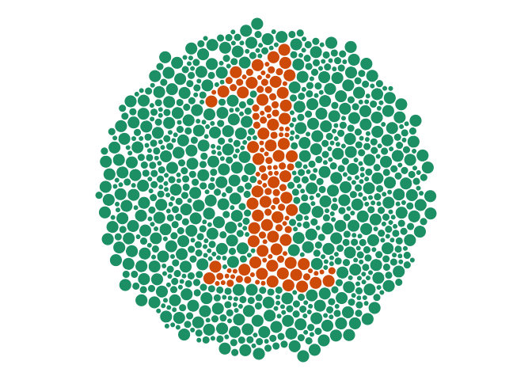
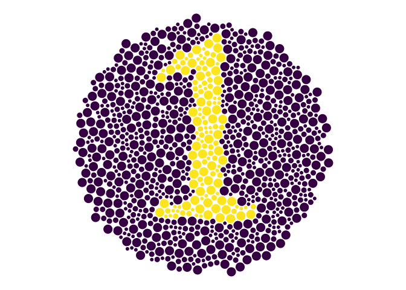
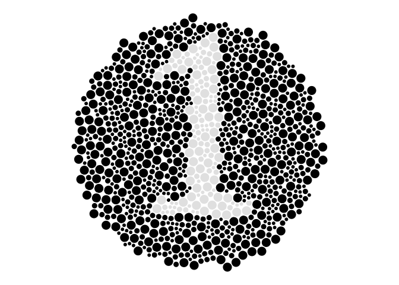

<!-- README.md is generated from README.Rmd. Please edit that file -->

# ishihara

<!-- badges: start -->

[](https://www.tidyverse.org/lifecycle/#experimental)
<!-- badges: end -->

The goal of ishihara is to create an [Ishihara
test](https://en.wikipedia.org/wiki/Ishihara_test), which can help
assess colourblindness.

There are a few implementations of this test around the web, but I
haven’t seen one that worked for R, so here is my crack at
implementing it.

Note that this is a work in progress, don’t use it for proper testing.

## Installation

The development version from [GitHub](https://github.com/) with:

``` r
# install.packages("devtools")
devtools::install_github("njtierney/ishihara")
```

## Proof of Concept

I had an idea on how I could maybe create this kind of figure in R,
using spatial tools. The general process is:

1.  Create a bunch of circles with `packcircles`
2.  Convert that to an SF object
3.  Pull in a vector font from `gridfont`
4.  Convert that font into an SF object
5.  Overlay the two SF objects and see where they intersect
6.  Plot the circles that are intersected by the text
7.  Change the colour palette in ggplot2 to see the impact of
    colourblindness

<!-- end list -->

``` r
library(ishihara)
## basic example code
library(ggplot2)
```

I’m still working through the details of the implementation and
usability, but the general idea is to create something like this:

``` r
set.seed(2020-05-10)
cb_1 <- ishihara_data("1")
gg_ishihara <- gg_ishihara(cb_1)
gg_ishihara
gg_ishihara + scale_fill_brewer(palette = "Dark2")
gg_ishihara + scale_fill_viridis_d()
gg_ishihara + scale_fill_manual(values = c("black", "grey90"))
gg_ishihara + scale_fill_manual(values = c("red", "green"))
```


